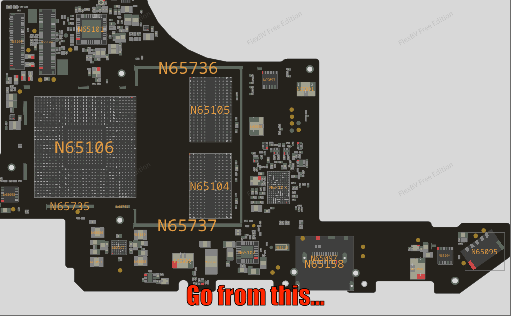

# PCB Part Renamer

Minimal GUI tool to inspect and rename part labels inside encrypted [**XZZ .pcb** boardview files](https://github.com/slimeinacloak/XZZPCB-ImHex/tree/main/Example%20PCB%20Files).

<p align="center">
  
</p>

## What does this tool do?

This tool makes boardviews easier to use by letting you **replace opaque, sequential part names with familiar IC/part names** inside encrypted **XZZ .pcb** boardview files, and by keeping those mappings shareable for teammates and future sessions.

- **Make boardviews readable**: encrypted PCB files use opaque sequential labels for parts. This tool lets you replace those with familiar IC/part names to immediately understand what each component is while inspecting the boardview.
- **Share and standardize mappings**: the `.partnames` file is a simple text file in JSON format, containing the list of all the parts you have renamed for a specific PCB file. You can freely edit this file using this tool or just a text editor, or share it without having to share the `.pcb` file. This way everyone can apply the part name mappings to their copy of the `.pcb` file and see the same human-friendly names. This also allows users to easily keep track of name mappings using version control.
- **Future updates**: mappings let you add or extend part name changes over time - you don't need to rename every part in a single session. Save `.partnames` files, extend them later as the mapping set grows, and apply the new names to the original `.pcb` file iteratively.
- **Compatibility**: The produced output `.pcb` file will be compatibile with both [OpenBoardView](https://github.com/OpenBoardView/OpenBoardView) (tested on v9.95.2) and [FlexBV](https://pldaniels.com/flexbv5/) (tested on v5.1244)

## Installation

You can run the tool by running the standalone `.exe` file (Windows only) or directly from source (cross-platform):

### Executable file (Windows only)

- Download and run `pcb_part_renamer.exe` from the repository [Releases](https://github.com/nitefood/pcb-part-renamer/releases/latest) page

### From source (cross-platform, requires Python)

1. Clone the repository and enter the folder:

```bash
git clone https://github.com/nitefood/pcb-part-renamer
cd pcb-part-renamer
```

2. Create & activate a Python 3.8+ virtual environment (recommended) and install dependencies:

```bash
python -m venv .venv
source .venv/bin/activate  # on Windows use `.venv\Scripts\activate`
pip install -r requirements.txt
```

3. Run the tool from the repository root:

```bash
python pcb_part_renamer.pyw
```

## Usage instructions

- Click "Open source .pcb" to load a board file. If a sibling `.partnames` file is present you will be offered to load it
- Use the search box to filter and jump to parts
- Double-click a part to edit the new name
  > _Note: the new name can not be longer than the old name, due to a limitation in the re-encrypting code. Pull requests welcome :-)_
- The right-side "Changed Parts" panel lists current edits (click an entry to jump to that part)
- Click "Save modified .pcb" to pick where to save the modified PCB
- **Mappings are saved alongside the original PCB as `*.partnames`**.

## Acknowledgements

- This project is inspired by (and builds on) the amazing reverse engineering work on the XXZPCB format by [slimeinacloak](https://github.com/slimeinacloak/XZZPCB-ImHex).
- Thanks [Paul L. Daniels](https://github.com/inflex) for the great support and for creating the awesome [FlexBV](https://pldaniels.com/flexbv5/)!
- Also thanks to the cool people from the [nanofix](https://www.youtube.com/@nanofixca) Discord community!
